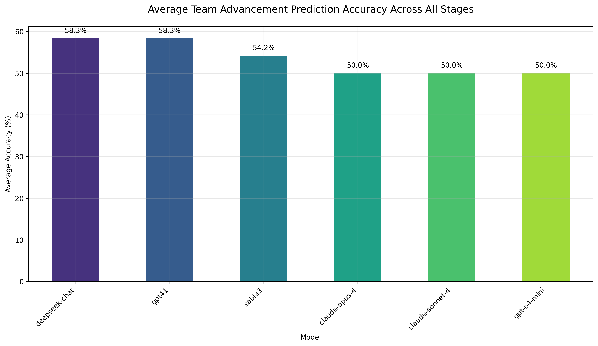
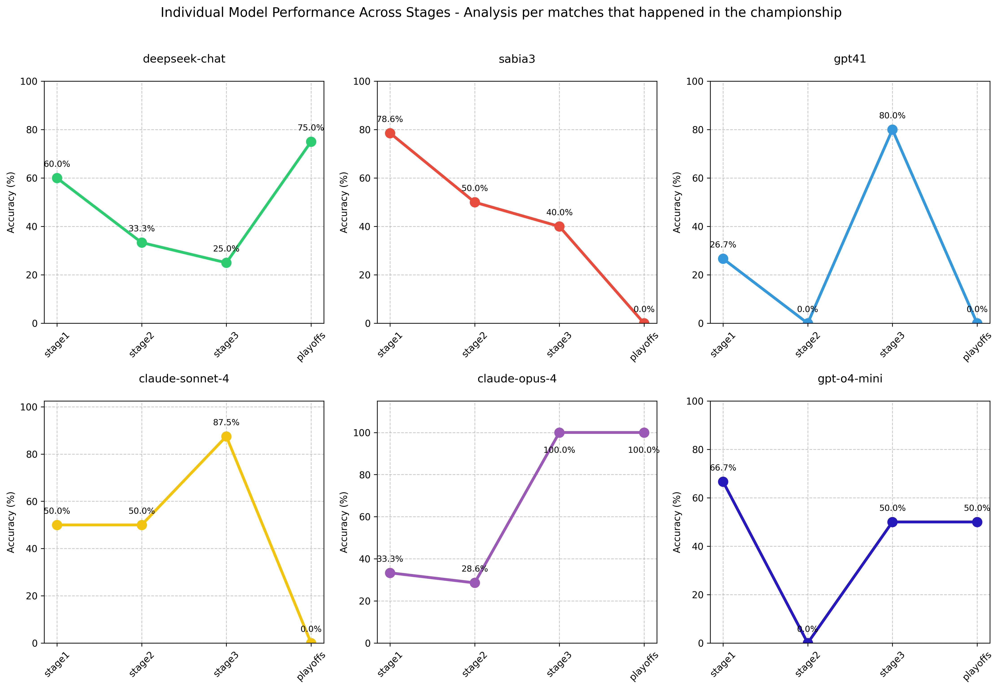

# Blast Austin 2025 Major Championship Results

There are four types of analysis here:

1. Raw analysis, each model output: [analysis-raw.md](analysis/analysis-raw.md)
2. Per stage advancement: [analysis-per-stage.md](analysis/analysis-advancements.md)
3. Individual matches analysis: [analysis-per-match.md](analysis/analysis-per-match.md)
4. Per final standings: [analysis-standings.md](analysis/analyze-standings.md)

# Cool graphs

## Stage advancements

## Individual matches

## Standings

